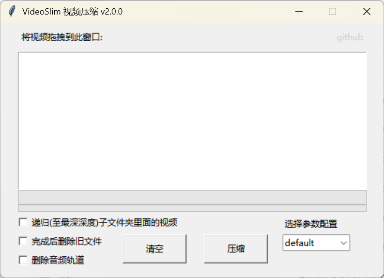
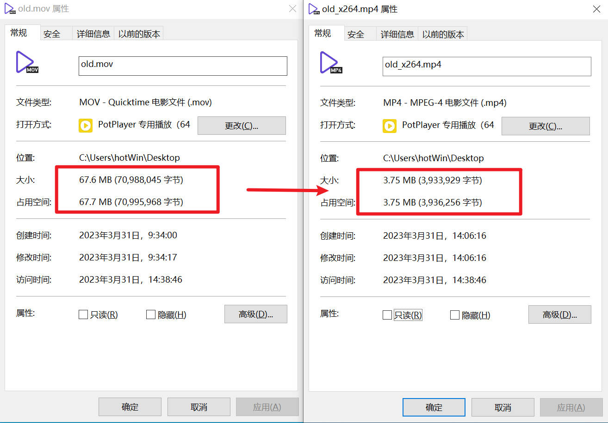

<h1 align="center" style="font-size:50px;font-weight:bold">VideoSlim</h1>
<p align="center">简洁易用的 Windows 视频压缩工具（增强版）</p>

<p align="center">
  
  <br/>
  
</p>

---

> 本仓库为 [DongGuoZheng/VideoSlim](https://github.com/DongGuoZheng/VideoSlim) 的**增强分支（fork）**，
> 在原版基础上新增硬件加速、码率自定义、编码器可选等能力。
> 原版版权归 inite（BSD-2-Clause），增强部分版权归 zcy205321334-bit，许可证不变。

## ✨ 相对原版的新特性

| 特性 | 原版 | 本增强版 |
|------|------|----------|
| 编码器 | 仅 libx264（CPU 软编） | **自动选择 / x264 / x265 / NVENC(H264/HEVC) / AMF / QSV** |
| 码率控制 | 仅 CRF 固定质量 | **质量优先(CRF) / 固定体积(ABR) / 质量+体积上限(capped CRF)** 三模式 |
| 压缩速度 | CPU 软编，30 分钟视频约 3.5 分钟 | **NVENC 硬编，30 分钟视频约 20 秒** |
| 体积控制 | 不可预估 | 固定体积模式可精确控制输出大小 |
| 音频码率 | 不可调 | 默认自适应，可自定义或删除音轨 |
| 编码器选择 | 无 | UI 下拉直接选，默认"自动(GPU优先)" |

**自动模式**：优先检测 NVIDIA 显卡（NVENC）→ AMD（AMF）→ Intel（QSV）→ 回退 CPU（libx264），无需手动配置。

## 功能特性
- **一键压缩**: 拖拽文件/文件夹到窗口，选择配置即可开始压缩
- **智能处理**: 自动修正视频旋转元数据，优化输出质量
- **多配置方案**: 内置默认、快速和高质量三种配置，支持自定义扩展
- **批量处理**: 支持递归扫描子文件夹，批量处理多个视频文件
- **高级选项**:
  - 编码器选择：自动(GPU优先) / x264 / x265 / H.264(NVENC) / H.265(NVENC) / AMF
  - 码率模式：质量优先(体积浮动) / 固定体积(推荐) / 质量+体积上限
  - 音频码率自适应，可自定义或删除音轨
  - 可选择删除音频轨道以进一步减小文件体积
  - 支持压缩完成后自动删除源文件
  - 可选 OpenCL GPU 加速（CPU 编码时）
- **日志记录**: 详细的操作日志（自动轮转），便于调试和问题排查
- **绿色便携**: 单文件可执行程序，无需安装，包含所有必要依赖

## 技术栈
- **Python 3.11+**: 主要开发语言
- **Tkinter**: 图形用户界面
- **FFmpeg**: 视频处理核心工具（已内置）
- **libx264 / libx265**: CPU 软件编码
- **NVENC / AMF / QSV**: 硬件加速编码（NVIDIA / AMD / Intel）
- **AAC**: 高级音频编码支持
- **pymediainfo**: 专业媒体信息解析库
- **windnd**: 实现拖拽功能
- **PyInstaller**: 应用程序打包工具

## 快速使用
**下载可执行文件**: 从发布页面下载 `VideoSlim.exe`（已包含所有依赖）

### 使用步骤
1. 将视频文件或包含视频的文件夹拖入窗口
2. 选择编码器和码率模式：
   - **编码器**：默认"自动(GPU优先)"，N 卡用户直接获得 NVENC 硬编加速
   - **质量优先**：填质量值（CRF，越小越清晰），体积不定
   - **固定体积**（推荐）：填目标码率，体积可预估
   - **质量+体积上限**：质量优先但体积封顶
3. 根据需要勾选高级选项：
   - 递归：同时处理子文件夹中的视频
   - 删除源文件：压缩完成后删除原始视频
   - 删除音频：移除视频中的音频轨道
4. 点击"压缩"按钮开始处理

**输出结果**: 处理完成后，将在源文件同目录生成 `*_x264.mp4` 文件。

### 码率估算公式
```
目标码率(kbps) ≈ 目标体积(GB) × 8192 ÷ 时长(秒)
```
例：2 小时视频压到 2GB 以内 → 码率填 `2 × 8192 ÷ 7200 ≈ 2275 kbps`。

## 配置
应用启动时读取 `config.json`。若不存在，将自动生成默认配置

### 参数说明

#### 编码器（encoder）
| 值 | 说明 |
|----|------|
| `auto` | 自动检测：NVENC → AMF → QSV → libx264（默认） |
| `libx264` | H.264 CPU 软编 |
| `libx265` | H.265 CPU 软编（体积更小，老设备可能不兼容） |
| `h264_nvenc` | NVIDIA H.264 硬编 |
| `hevc_nvenc` | NVIDIA H.265 硬编（体积小 30~40%） |
| `h264_amf` | AMD 硬编 |

#### 码率模式（rate_control）
| 值 | 说明 |
|----|------|
| `crf` | 质量优先，填 crf（0-51，越小越清晰，推荐 18-28） |
| `abr` | 固定体积，填 bitrate（kbps），输出体积可预估 |
| `capped_crf` | 质量优先 + 体积上限（crf + maxrate/bufsize） |

#### 其他参数
| 参数名 | 取值范围 | 默认值 | 说明 |
|--------|---------|--------|------|
| **preset** | 编码预设字符串 | slow | 编码速度/压缩效率平衡 |
| **I** | 正整数 | 600 | 关键帧间隔（GOP） |
| **r** | 正整数 | 4 | 参考帧数量 |
| **b** | 正整数 | 3 | B 帧数量 |
| **audio_bitrate** | 0 或正整数 | 0 | 音频码率 kbps，0=自适应（不删音轨） |
| **delete_audio** | true/false | false | 删除音频轨道 |
| **opencl_acceleration** | true/false | false | OpenCL GPU 加速（CPU 编码时） |

## 构建指南

### 环境准备
1. **安装 Python**: 确保安装了 Python 3.11 或更高版本
2. **克隆项目并进入项目根目录**:
   ```bash
   git clone https://github.com/zcy205321334-bit/VideoSlim.git
   cd VideoSlim
   ```
3. **安装 uv**:
   ```bash
   pipx install uv
   ```
4. **创建虚拟环境并安装依赖**:
   ```bash
   uv venv
   uv sync --extra dev
   ```
5. **安装构建工具**:
   ```bash
   uv pip install pyinstaller
   ```

### 构建
项目提供了 `scripts/build.cmd` 自动化构建脚本，可一键生成单文件可执行程序：

```bash
# 在项目根目录运行
scripts/build.cmd
```

构建完成后，可执行文件将位于：`output/dist/VideoSlim.exe`

## 目录结构
```
VideoSlim/
├── main.py                # 应用程序启动入口
├── config.json            # 配置文件（首次运行自动生成）
├── pyproject.toml         # Python 项目配置
├── README.md              # 项目文档
├── LICENSE                # 许可证文件（BSD-2-Clause）
├── src/                   # 源代码主目录
│   ├── controller.py      # MVC 控制器层
│   ├── view.py            # MVC 视图层
│   ├── meta.py            # 应用常量和版本定义
│   ├── service/           # 核心服务模块
│   │   ├── video.py       # 视频压缩处理服务（编码器分支/硬件加速）
│   │   ├── config.py      # 配置管理服务
│   │   ├── message.py     # 消息通信服务
│   │   └── updater.py     # 更新检查服务
│   ├── model/             # 数据模型定义
│   └── utils/             # 工具函数库
├── tools/                 # 内置工具集
│   ├── ffmpeg.exe         # FFmpeg 视频处理引擎
│   ├── icon.ico           # 应用程序图标
│   └── LICENSE            # 第三方工具许可证
├── img/                   # 文档截图和资源
├── scripts/               # 辅助脚本
│   └── build.cmd          # 自动化构建脚本
└── output/                # 构建输出目录
```

## 许可证
本项目采用 **BSD-2-Clause** 许可证，详见 `LICENSE` 文件。
- 原版版权：© 2023 inite（[DongGuoZheng/VideoSlim](https://github.com/DongGuoZheng/VideoSlim)）
- 增强部分：© 2026 zcy205321334-bit
- FFmpeg 和其他第三方工具按其各自许可证使用与分发。

## 致谢
- **FFmpeg**: 强大的音视频处理工具
- **DongGuoZheng/VideoSlim**: 本项目的基础原版
